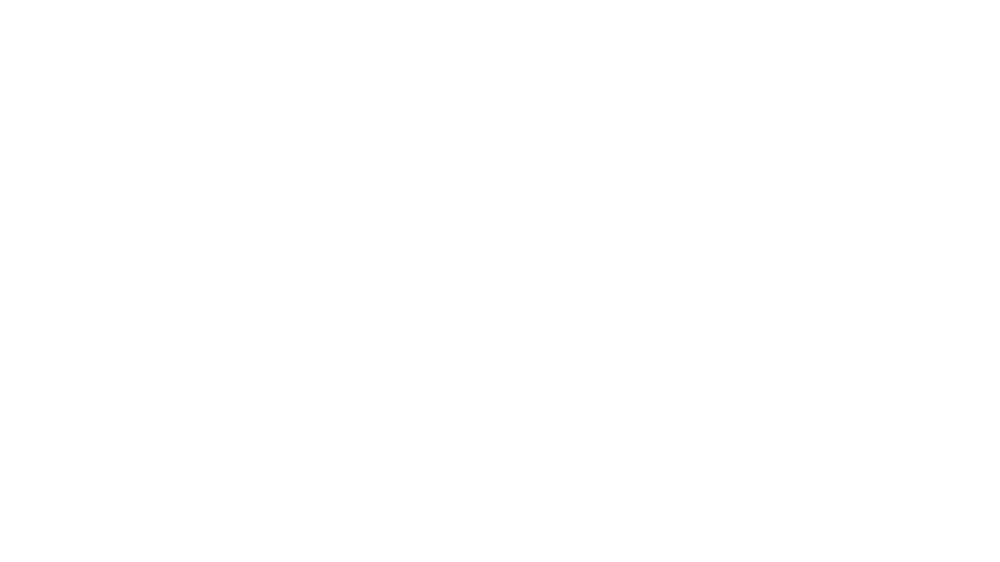
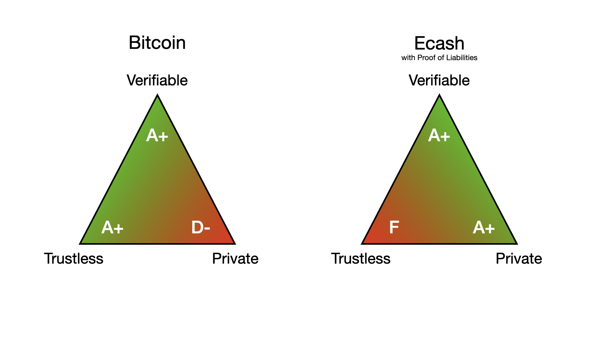
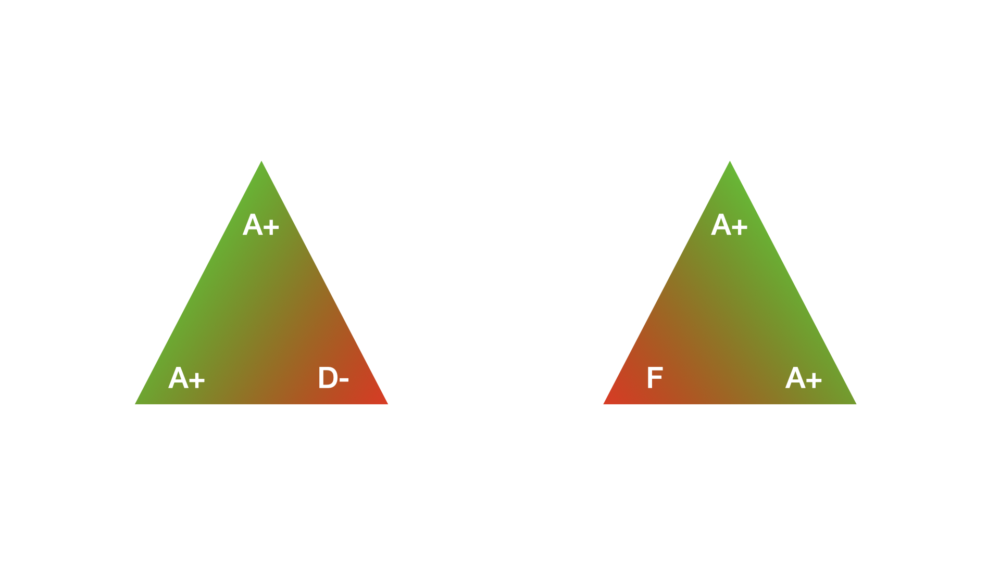

+++
title = "What is Hashpool?"
slug = "what-is-hashpool"
template = "article.html"
description = """
Hashpool is an accountless mining pool that uses ecash to represent mining shares. Unlike existing mining pools, Hashpool cryptographically blinds the user's identity and creates a free market for trading mining shares.
"""
+++

### The Problem With Mining Pools

In the earliest days of bitcoin anyone could mine on a laptop by running the bitcoin client. Things have changed a lot in the last 15 years. These days miners need to buy special hardware called ASIC miners and mining pools are optimized for large mining farms with hundreds or thousands of ASIC appliances hashing away 24/7. The deck is stacked against small miners just getting started.

### Minimum Withdrawals and Onboarding Fees

All mining pools have a minimum withdrawal threshold, which means that if you want to start with the smallest ASIC available it can take years or decades of hashing before you are able to withdraw your earnings on-chain.

Some pools offer lower thresholds for lightning withdrawals, but lightning comes with it's own challenges. If you use a custodial lightning wallet you give up all transaction privacy and your funds are always at risk of being rugged, or stolen by the custodian.

If you decide to use a self-custodial wallet you can eliminate the rug risk but you pay for it with technical complexity. You need to open a lightning channel before you can use your wallet, which requires an on-chain fee. If you don't already have some bitcoin you'll need to buy a channel from another lightning node. This amounts to an onboarding fee, which is not a good experience for new users wanting to start small.

### Mining Privacy

Mining pools today are terrible for privacy. Most pools require KYC before you create an account. Even for the pools that don't require KYC they know three critical pieces of information: your IP address (easily linked to your identity), your hashrate, and your bitcoin payouts. As a result, if you want to mine privately or at a small scale there just aren't any good options.

### How Does Hashpool Help?

Hashpool solves these problems using a privacy technology called ecash. Ecash is actually an old idea, invented in 1982 that didn't achieve success in the 90s or 2000s. With the introduction of bitcoin as a natively digital hard money, ecash is experiencing a renaissance.

### How Ecash Works

An ecash token is a bearer asset issued by a custodian, called a mint. Mints are just like digital banks and ecash is best thought of as a paper bank note. An ecash token is an IOU for some other asset custodied by the mint. Modern ecash mints operate on a bitcoin standard and can send and receive lightning transactions. This makes them interoperable with any exchange, wallet, or merchant on the lightning network.

The secret sauce that makes ecash work is a cryptographic technique called blind signing. Blind signatures work kind of like carbon paper. If you put a piece of carbon paper in between two other pieces of paper, anything you write on the top sheet will be transferred automatically to the bottom sheet. Imagine writing a letter, putting it underneath a piece of carbon paper, and putting them both inside a sealed envelope . Now take that envelope to the bank and get a bank official to sign it without looking inside. When you open the envelope and remove the letter it will have a valid signature from a bank official but the bank has no idea what the letter says. They blindly signed the message.

  

  

Ecash tokens work by having the mint blind sign a secret only after a user deposits some asset. The user then privately unblinds the secret and the signature. Thanks the magic of cryptography, the unblinded signature can be verified by anyone who knows the mint's public key. The combination of unblinded secret and unblinded signature is called an ecash token. Just like physical cash, ecash can be freely traded without the mint knowing the identity of it's users.

### Privacy

Hashpool uses ecash to enable an accountless mining pool. Instead of the pool keeping track of the balance of every user account within it's database, a hashpool issues ecash tokens for each mining share and only keeps track of how many tokens are outstanding. This means it doesn't need to know or care who is mining and who is redeeming mining rewards.

Hashpool is being built for small pool operators. By default, it won't require users to sign up or submit KYC information. But it's up to the operator whether to authenticate users. Anyone can mine anonymously as long as there is at least one anonymous hashpool instance somewhere in the world. How cool is that?

### Minimum Withdrawal Threshold

Because ecash is so darn efficient it doesn't have a minimum payment threshold. You can send a single satoshi to a brand new wallet just as easily as you can send a million sats. As long as the hashpool instance supports ecash payouts, there is no onboarding fee. This means that hashpools can efficiently serve even the smallest miners. BitAxe fans rejoice!

### eHash

Mining shares are a precursor to bitcoin, they are a necessary ingredient in the process of mining new bitcoin. If you think of bitcoin as jet fuel then mining shares are crude oil. They are the raw commodity that gets turned into a valuable product. Because of this, Hashpool doesn't issue bitcoin-backed ecash in return for mining shares. Instead, Hashpool uses a new asset called eHash. Ehash tokens are ecash tokens backed by proof of work instead of bitcoin.

### Mining Futures

Ehash takes time to mature and accrue bitcoin value. For a limited time after the token is issued, it gains value with each bitcoin block found by the mining pool. Once this time window expires the eHash token will stop accruing value and can be redeemed for bitcoin, either directly via lightning or an on-chain transaction, or indirectly using ecash.

Ehash can be freely traded but it's value is not fixed. Each token represents a claim for some asset to be delivered in the future. This makes eHash a futures instrument. Mining futures are very useful for two reasons: they enable miners to hedge their risk by selling their hashrate before it fully matures, and they allow purchasers to buy bitcoin at a discount in exchange for assuming some risk.

In many countries around the world, futures markets are not accessible to the average person. With hashpool, anyone anywhere can access bitcoin block reward futures at any scale of operation. Thanks to the efficiency and privacy properties of ecash, these futures instruments will be extremely liquid and free (as in speech). Let's go, baby! 🚀

### But Isn't Ecash Custodial?

The most common criticism ecash faces from bitcoiners is that it is a custodial system. This is absolutely true. One of the defining properties of bitcoin is that it is trustless and self-sovereign; you don't need permission from anyone to use bitcoin. Unlike bitcoin, ecash requires you to trust the mint.

What this means in practice is simple: *DO NOT store your life savings in an ecash mint*. You need to put those sats on-chain and keep the private keys in offline cold storage. Ecash is like physical cash, you should only keep enough in your wallet to cover your daily or monthly expenses.

### The Dream Team

I like to map out digital currencies in terms of three properties: trustlessness, privacy, and verifiability. Bitcoin goes hard on trustlessness and verifiability. No other kind of money known to mankind is more easily or perfectly verifiable. Nothing except commodity money like gold is as trustless as bitcoin. On these two metrics, there is literally no comparison. But because of the nature of the blockchain, bitcoin has terrible privacy properties.

Anyone in the world can use a blockchain explorer and trace the flow of money. Once the owner of a bitcoin address is doxxed its entire transaction history and future can be monitored unless the owner takes active measures to regain their privacy such as coinjoins, coin swaps, or other privacy techniques. This was the tradeoff made by Satoshi Nakamoto that makes bitcoin possible.

Ecash, on the other hand, slides the slider all the way away from trustlessness to privacy. Cypherpunks are working to make mints fully verifiable using a protocol called Proof of Liabilities (currently under development). Thanks to the cryptographic magic of blind signatures, ecash has theoretically perfect privacy. Unlike bitcoin, ecash has no transaction graph so even the mint cannot correlate payments between users.

  

  

In practice, users can freely swap value between ecash and bitcoin, leveraging the strengths of each system and minimizing their weaknesses. This is what makes ecash such a fantastic complement to bitcoin and why it is experiencing a rennaissance today. Together, ecash and bitcoin are the dream team.

### Better Custodians

An ecash mint is the best kind of custodian: a private accountless custodian. This is a huge improvement over account-based custodians because it means a mint cannot selectively refuse service. All mining pools are custodial in nature. Hashpool will enable pools to be the best kind of custodian: a private and verifiable custodian.

Hashpool is still in early development and we're looking for help! If you would like to contribute please get in contact!
